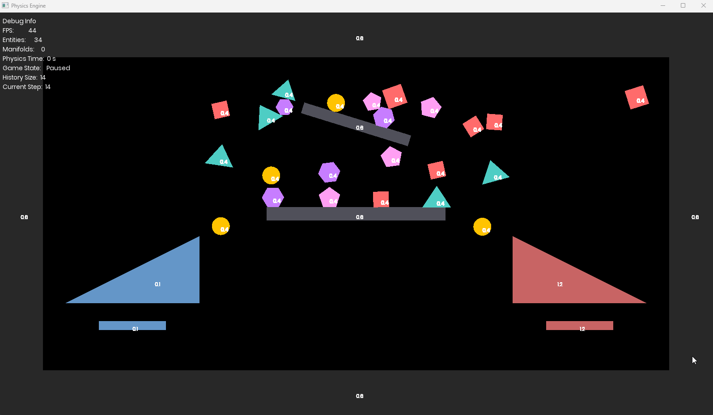

# 2D Physics Engine

A rigid body physics simulation built with C++ and SFML.

## Demo



*Various shapes (boxes, circles, triangles, hexagons, pentagons) interacting with different friction surfaces*

## Features

- **Rigid body dynamics** with proper mass, inertia, and friction
- **Multiple shape types**: boxes, circles, triangles, and arbitrary convex polygons
- **Collision detection**: SAT for polygon-polygon, optimized circle and polygon-circle checks
- **Impulse-based collision resolution** with friction and restitution
- **Spatial partitioning** using a grid for broad-phase collision detection
- **Debug visualization** with gizmos for normals, contact points, and forces

## Building

Requires:
- C++20 compiler
- SFML 3.0+
- CMake (or your build system of choice)

## Project Structure

```
├── Physics/
│   ├── Core/
│   │   └── Rigidbody.cpp/h        # Rigid body with shape data
│   ├── Dynamics/
│   │   └── Solvers/
│   │       ├── ImpulseSolver.cpp/h # Collision response
│   │       └── ISolver.h           # Solver interface
│   ├── Collision/
│   │   ├── BroadPhase/
│   │   │   └── Grid.cpp/h          # Spatial grid
│   │   └── NarrowPhase/
│   │       ├── CollisionDetector.cpp/h  # SAT, circle checks
│   │       └── CollisionManifold.h      # Contact data
│   └── PhysicsWorld.cpp/h          # Main simulation loop
├── Utils/
│   └── MathUtils.h                 # Vector math helpers
└── Application.cpp/h               # Window and scene setup
```

## Creating Bodies

Bodies are created through static factory methods:

```cpp
RigidbodyConfig config;
config.mass = 1.0f;
config.friction = 0.4f;
config.restitution = 0.5f;

// Built-in shapes
Rigidbody* box = Rigidbody::CreateBox(1.0f, 1.0f, config);
Rigidbody* circle = Rigidbody::CreateCircle(0.5f, config);
Rigidbody* tri = Rigidbody::CreateTriangle(p1, p2, p3, config);

// Custom polygons (vertices must be CCW)
std::vector<sf::Vector2f> hexVertices = { /* ... */ };
Rigidbody* hex = Rigidbody::CreatePolygon(hexVertices, config);

// Static bodies (infinite mass)
config.mass = 0.0f;
Rigidbody* wall = Rigidbody::CreateBox(10.0f, 1.0f, config);
```

## Physics Config

```cpp
RigidbodyConfig config;
config.mass = 1.0f;              // 0 = infinite mass (static)
config.restitution = 0.5f;       // bounciness (0-1)
config.friction = 0.4f;          // surface friction
config.damping = 0.8f;           // linear velocity damping
config.angularDamping = 2.0f;    // angular velocity damping
```

## Controls

- **Space** - Pause/unpause simulation
- **Right Arrow** - Step forward one frame (when paused)
- **Left Arrow** - Step backward (when paused)

## Implementation Notes

### Collision Detection

Uses SAT (Separating Axis Theorem) for polygon-polygon collisions. Normals are calculated assuming CCW vertex ordering. The collision manifold stores reference/incident bodies, contact points, collision axis, and penetration depth.

### Collision Resolution

Impulse-based solver with positional correction. Friction uses Coulomb's model with both static and kinetic regimes. Angular impulses are applied for realistic rolling behavior.

### Coordinate System

- Origin at top-left
- +X right, +Y down (standard SFML)
- Angles in radians
- Polygons must be CCW for correct normal calculation

### Performance

Grid-based broad phase reduces collision checks from O(n²) to roughly O(n). Adjust cell size in `PhysicsWorld` constructor based on average object size.

## Known Issues

- No CCD (continuous collision detection) - fast objects can tunnel
- Solver can be unstable with very high mass ratios
- Stacking is not perfectly stable

## License

MIT